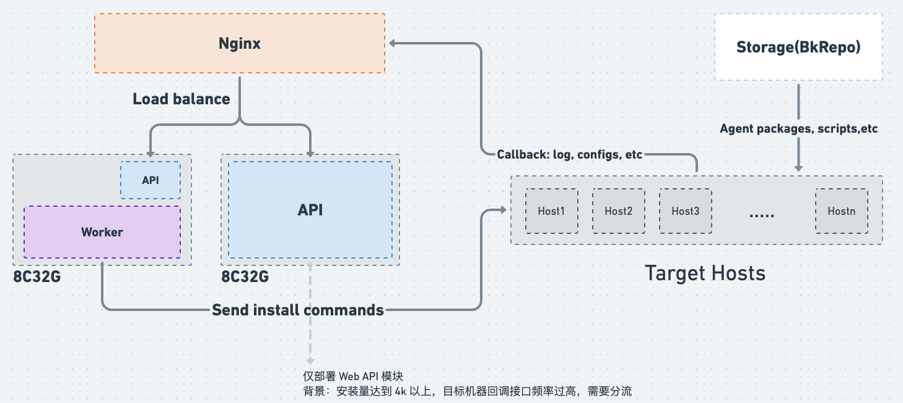

# Agent 安装压测

* [环境信息](#环境信息)
   * [测试环境](#测试环境)
   * [测试机器](#测试机器)
   * [部署方式](#部署方式)
   * [Celery 启动方式](#celery-启动方式)
* [并发控制](#并发控制)
   * [参数](#参数)
   * [配置方式](#配置方式)
   * [Agent 安装应用](#agent-安装应用)
* [Linux](#linux)
   * [limit=50](#limit50)
   * [limit=100（ 8C32G 下推荐，已验证稳定性）](#limit100-8c32g-下推荐已验证稳定性)
   * [limit=150](#limit150)
* [Windows](#windows)
   * [Cygwin（推荐）](#cygwin推荐)
   * [WMIEXE（放开 445 端口，不推荐）](#wmiexe放开-445-端口不推荐)
* [Celery 启动命令](#celery-启动命令)


## 环境信息

### 测试环境

* **8 核 32 G**
* **Linux 3.10.107**
* **asyncssh - 2.8.1**
* **paramiko - 2.8.1**

### 测试机器

* 5000 台 Linux 机器
* 2000 台 Windows 机器


### 部署方式



❓为什么需要单独一台机器部署 API
* 压测到 4k 台机器时发现部分目标机器访问 `日志上报` 以及 `拉取配置` 出现 `Connect Reset` 的问题，用于分担访问压力

### Celery 启动方式

**-P threads -c 100**


## 并发控制

### 参数

* `execute_all` 是否全量执行
* `limit` 每批任务的执行数量限制
* `is_concurrent_between_batches` 批次间是否并发执行
* `interval` 任务提交间隔

### 配置方式

models.GlobalSettings.CONCURRENT_CONTROLLER_SETTINGS

```json
{
  "SERVICE_SSH": {
    "limit": 100,
    "interval": 0,
    "execute_all": false,
    "is_concurrent_between_batches": true
  },
  "SERVICE_WMIEXE": {
    "limit": 50,
    "interval": 0,
    "execute_all": false,
    "is_concurrent_between_batches": true
  }
}
```

### Agent 安装实践

* `SERVICE_SSH` 通过 SSH 通道进行命令下发（包括 Cygwin）
    * 批次内协程并发，limit=100
* `SERVICE_WMIEXE` Windows（445 端口）
    * 批次内并发执行，limit=4


## Linux 


### limit=50

| 机器数量 | 耗时        | 平均耗时 | 失败数 | 失败原因                                                     | 平峰         | 峰值CPU使用率 | CPU（增幅） | 峰值内存已用占比 | 内存（增幅） |
| -------- | ----------- | -------- | ------ | ------------------------------------------------------------ | ------------ | ------------- | ----------- | ---------------- | ------------ |
| 1        | 69/66/56    | 63.667   | 0/0/0  |                                                              |              |               |             |                  |              |
| 50       | 70/75/79    | 74.667   | 0/0/0  |                                                              |              |               |             |                  |              |
| 100      | 86/97/77    | 86.667   | 0/0/0  |                                                              |              |               |             |                  |              |
| 200      | 93/83/76    | 84.0     | 0/0/0  |                                                              |              |               |             |                  |              |
| 300      | 92/86/117   | 98.333   | 0/4/0  | 命令执行超时                                                 |              |               |             |                  |              |
| 400      | 90/85/92    | 89.0     | 0/0/0  |                                                              |              |               |             |                  |              |
| 500      | 111/105/90  | 102.0    | 0/0/0  |                                                              |              |               |             |                  |              |
| 1000     | 112/111/110 | 111.0    | 0/0/0  |                                                              | 8.14%/73.6%  | 28.46%        | 20.32%      | 75.2%            | 1.6%         |
| 1500     | 133/118/115 | 122.0    | 0/1/0  | 命令执行超时                                                 | 8.22%/73.5%  | 30.58%        | 22.36%      | 75.2%            | 1.7%         |
| 2000     | 157/121/131 | 136.333  | 0/0/0  |                                                              | 6.53%/73.44% | 31.96%        | 25.43%      | 75.72%           | 2.28%        |
| 3000     | 168/168/160 | 165.333  | 0/0/0  |                                                              | 4.15%/73.4%  | 37.83%        | 33.68%      | 76.16%           | 2.76%        |
| 4000     | 169/188/187 | 181.333  | 1/2/1  | 1. 执行命令超时<br />2. 安装脚本报错（1）basereport start failed.；执行命令超时（1）<br />3. 安装脚本报错 start gse agent failed（1） | 4.61%/73.41% | 58.72%        | 54.11%      | 76.77%           | 3.36%        |
| 5000     | 202/187/203 | 197.333  | 2/3/3  | 1. 安装机器本身的问题，无法登录（数量2）<br />2. 连接丢失，远程系统未响应或登录超时：Connection lost(1);安装机器本身问题（2）<br />3.  安装机器本身的问题，无法登录（数量2）；命令执行超时（1） | 3.86%/73.61% | 72.52%        | 68.66%      | 78.07%           | 4.46%        |


### limit=100（ 8C32G 下推荐，已验证稳定性）

| 机器数量 | 耗时        | 平均耗时 | 失败数 | 失败原因                                 | 平峰        | 峰值CPU使用率 | CPU（增幅） | 峰值内存已用占比 | 内存（增幅） |
| -------- | ----------- | -------- | ------ | ---------------------------------------- | ----------- | ------------- | ----------- | ---------------- | ------------ |
| 1        | 50/57/55    | 54.0     | 0/0/0  |                                          |             |               |             |                  |              |
| 50       | 71/74/89    | 78.0     | 0/0/0  |                                          |             |               |             |                  |              |
| 100      | 96/83/83    | 87.33    | 0/0/0  |                                          |             |               |             |                  |              |
| 200      | 78/99/83    | 86.667   | 0/0/0  |                                          |             |               |             |                  |              |
| 300      | 106/74/85   | 88.333   | 0/0/0  |                                          |             |               |             |                  |              |
| 400      | 88/95/98    | 93.667   | 0/0/0  |                                          |             |               |             |                  |              |
| 500      | 97/115/100  | 104.0    | 0/0/0  |                                          |             |               |             |                  |              |
| 1000     | 127/93/116  | 112.0    | 0/0/0  |                                          | 6.77%/72.3% | 26.26%        | 19.49%      | 75%              | 2.7%         |
| 1500     | 129/111/111 | 117.0    | 0/0/0  |                                          | 7.5%/72.4%  | 28.1%         | 20.6%       | 76.1%            | 3.7%         |
| 2000     | 152/117/131 | 133.333  | 0/0/0  |                                          | 6.3%/72.4%  | 38.7%         | 32.4%       | 76.7%            | 4.3%         |
| 3000     | 172/146/151 | 156.333  | 0/0/1  | start gse agent failed                   | 5.6%/72.2%  | 48.5%         | 42.9%       | 78.5%            | 6.3%         |
| 4000     | 173/151/164 | 162.667  | 0/0/0  |                                          | 3.9%/72.9%  | 59.6%         | 53.7%       | 79.33%           | 6.43%        |
| 5000     | 177/173/165 | 171.667  | 2/2/2  | 1. 安装机器本身的问题，无法登录（数量2） | 5.7%/72.12% | 71.6%         | 65.9%       | 79.94%           | 7.8%         |


### limit=150

| 机器数量 | 耗时        | 平均耗时 | 失败数 | 失败原因                                                     | 平峰         | 峰值CPU使用率 | CPU（增幅） | 峰值内存已用占比 | 内存（增幅） |
| -------- | ----------- | -------- | ------ | ------------------------------------------------------------ | ------------ | ------------- | ----------- | ---------------- | ------------ |
| 1        | 58/79/69    | 68.667   | 0/0/0  |                                                              |              |               |             |                  |              |
| 50       | 74/74/91    | 79.667   | 0/0/1  | 命令执行超时                                                 |              |               |             |                  |              |
| 100      | 94/75/70    | 79.667   | 0/0/0  |                                                              |              |               |             |                  |              |
| 200      | 90/87/88    | 88.333   | 0/0/0  |                                                              |              |               |             |                  |              |
| 300      | 78/85/81    | 88.333   | 0/0/0  |                                                              |              |               |             |                  |              |
| 400      | 85/91/94    | 93.667   | 0/0/0  |                                                              |              |               |             |                  |              |
| 500      | 109/91/107  | 102.333  | 1/0/0  |                                                              |              |               |             |                  |              |
| 1000     | 104/109/109 | 107.333  | 0/0/0  |                                                              | 3.42%/74.0%  | 18.06%        | 14.62%      | 75%              | 1%           |
| 1500     | 111/104/122 | 112.333  | 0/1/0  | 命令执行超时                                                 | 3.16%/73.7%  | 26.73%        | 23.57%      | 75.5%            | 1.8%         |
| 2000     | 116/127/118 | 120.333  | 0/0/0  |                                                              | 4.17%/73.2%  | 31.45%        | 27.38%      | 75.2%            | 2%           |
| 3000     | 134/143/165 | 147.333  | 2/0/0  | 命令执行超时                                                 | 3.02%/73.8%  | 38.16%        | 35.14%      | 76.3%            | 2.5%         |
| 4000     | 184/188/150 | 174.0    | 0/3/1  | 命令执行超时                                                 | 2.9%/73.4%   | 56.69%        | 53.79%      | 77.4%            | 4%           |
| 5000     | 195/187/175 | 185.667  | 2/3/62 | 1. 安装机器本身的问题，无法登录（数量2）<br />2. 同1；命令执行超时（1）<br />3. 同1；连接超时 60 | 4.39%/73.55% | 69.07%        | 64.68%      | 78.8%            | 5.25%        |


## Windows

### Cygwin（推荐）


| 机器数量 | 耗时        | 平均耗时 | 失败数 | 失败原因 | 平峰          | 峰值CPU使用率 | CPU（增幅） | 峰值内存已用占比 | 内存（增幅） |
| -------- | ----------- | -------- | ------ | -------- | ------------- | ------------- | ----------- | ---------------- | ------------ |
| 1        | 90/108/84   | 94.0     | 0/0/0  |          |               |               |             |                  |              |
| 50       | 97/98/96    | 97.0     | 0/0/0  |          |               |               |             |                  |              |
| 100      | 94/100/114  | 102.667  | 0/0/0  |          |               |               |             |                  |              |
| 200      | 105/102/102 | 103.0    | 0/0/0  |          |               |               |             |                  |              |
| 300      | 117/113/105 | 111.667  | 0/0/0  |          |               |               |             |                  |              |
| 400      | 126/124/118 | 122.667  | 0/0/0  |          |               |               |             |                  |              |
| 500      | 143/133/124 | 133.333  | 0/0/0  |          |               |               |             |                  |              |
| 1000     | 130/143/130 | 134.333  | 0/0/0  |          | 12.43%/58.38% | 27.3%         | 14.87%      | 59.93%           | 1.55%        |
| 1500     | 272/163/238 | 224.333  | 0/0/0  |          | 7.15%/58.9%   | 34.40%        | 27.25%      | 61.2%            | 2.2%         |
| 2000     | 274/265/242 | 260.333  | 0/0/0  |          | 7.11%/58.3%   | 38.7%         | 31.69%      | 61.5%            | 3.2%         |


我们对比目标机器获取依赖文件的多种方式，及存储源的不同

得出结论：建议 **文件源** 单独部署，保证 Cygwin 已安装 `curl`，从而提高 Windows Agent 安装效率，避免节点管理后台负载过高


| 方式                   | 耗时        | 平均耗时 | 失败数      | 失败原因       | 平峰        | 峰值CPU使用率 | CPU（增幅） | 峰值内存已用占比 | 内存（增幅） |
|----------------------| ----------- | -------- | ----------- | -------------- | ----------- | ------------- | ----------- | ---------------- |--------|
| * pull（目标机器主动拉取依赖文件） | 274/265/242 | 260.333  | 0/0/0       |                | 7.11%/58.3% | 38.7%         | 31.69%      | 61.5%            | 3.2%   |
| put（推送文件到目标机器）       | 505/485/517 | 502.333  | 2/2/0       | async 连接超时 | 4.26%/58.2% | 89.81%        | 85.55%      | 98.9%            | 40.7%  |
| nginx-put（下载源更换为Nginx） | 733/745/735 | 86.667   | 182/170/172 |                | 3.82%/17.0% | 87.4%         | 83.58%      | 58.9%            | 41.9%  |


### WMIEXE（放开 445 端口，不推荐）


## Celery 启动命令

我们对比了不同 Celery 启动命令，在安装 2000 台 Windows 机器 Agent 的耗时：

| 机器数量 | -P threads -c  100 | -c 50   |
| -------- | ------------------ | ------- |
| 1        | 94                 | 94.667  |
| 50       | 97                 | 104.667 |
| 100      | 102.667            | 101.333 |
| 200      | 103                | 127     |
| 300      | 111.667            | 121     |
| 400      | 122.667            | 130.667 |
| 500      | 133.333            | 127     |
| 1000     | 134.333            | 135.333 |
| 1500     | 224.333            | 254     |
| 2000     | 260.333            | 306.333 |

同时也记录下非高峰期节点管理后台的内存占用比例：

| 启动命令           | 平峰内存占用 |
| ------------------ | ------------ |
| -P threads -c  100 | 58.30%       |
| -c 50              | 81.24%       |


推荐使用 **线程**，即 `-P threads -c 100` 的方式启动 Celery，提升安装效率并降低资源消耗


更多数据，请参考 **docs/benchmark/agent_install/agent_install_data.xlsx**
