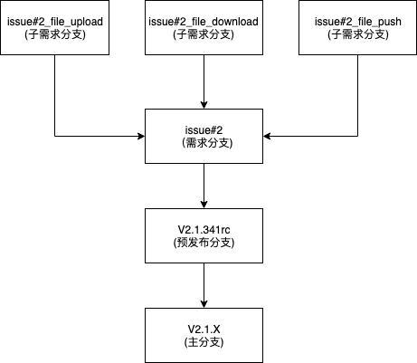

# 分支管理

## 分支命名

### 主分支
以 `V.{major_version}.{minor_version}.X` 命名

### 预发布分支
以 `V.{major_version}.{minor_version}.{patch_version}rc` 命名

### issue分支
以 `issue#{issue_num}` 命名

### issue子需求分支
以 `issue#{issue_num}_{func_desc}` 命名


## 代码合入流程
```
          子需求分支
              ↓
           需求分支
              ↓
          预发布分支
              ↓
            主分支
```
如：



## PR & COMMIT 规范
- 请尽量使用 `git rebase -i [commit_id]` 来整理你的commits，原则上一个 Pull Request 只对应一个commit
- 发起 Pull Request 时请将目标分支修改为「最新的预发布分支」
- 仓库维护者最后会以 `rebase merge` 的方式合入代码