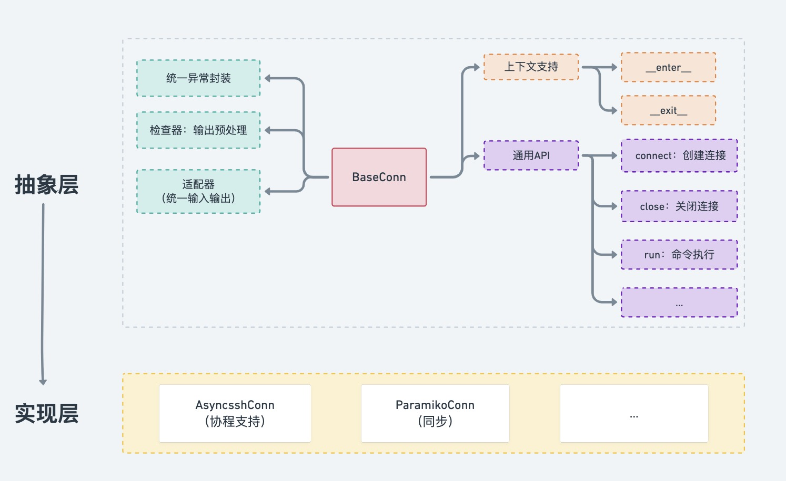

# remote
🔧 远程连接统一适配

* 屏蔽各远程连接库调用逻辑，向上提供统一调用 API
* 统一异常封装
* 定制化开发


## remote.conns




## benchmark

### 测试环境

* **8 核 32 G**
* **Linux 3.10.107**
* **asyncssh - 2.8.1**
* **paramiko - 2.8.1**

### 测试机器

* 5000 台 Linux 机器
* 登录方式为 `password` 或 `keyboard-interactive`

### 测试命令

我们选取覆盖以下功能的 Linux 命令用于测试：

* 获取内核信息
* 文件写入、权限修改
* nohup 异步执行

```python
CMDS = [
    "uname -sr",
    "echo 'sleep 5 && ls -al' > /tmp/sleep.sh && chmod +x /tmp/sleep.sh",
    "nohup bash /tmp/sleep.sh &> /tmp/nm.nohup.out &",
]
```

### 串行对比


```python
from apps.utils import concurrent
from apps.core.remote.benchmark.conns import core

core.CONCURRENT_CONTROL_CONFIG = {
    "limit": 1,
    "execute_all": False,
    "is_concurrent_between_batches": False,
    "interval": 0,
}

core.do_performance(
    nums=[1, 5, 10, 20, 50],
    repeat=3,
    # call_func=core.execute_cmds_with_ssh_man,
    # call_func=core.execute_cmds_with_paramiko,
    call_func=core.execute_cmds_with_asyncssh_in_sync,
    batch_call_func=concurrent.batch_call_serial
)
```

| 机器数量/方式/耗时（秒） | asyncssh | paramiko | ssh_man(paramiko extend) |
| ------------------------ | -------- | -------- | ------------------------ |
| 1                        | 0.572    | 0.788    | 10.848                   |
| 5                        | 2.957    | 3.999    | 54.276                   |
| 10                       | 5.619    | 7.675    | 108.327                  |
| 20                       | 11.487   | 15.444   | 217.233                  |
| 50                       | 28.933   | 38.689   | 544.957                  |


### 并行对比

```python
from apps.utils import concurrent
from apps.core.remote.benchmark.conns import core

# 设置 execute_all=True，即不在上层分批
# 选择 batch_call 多线程并发执行下发命令逻辑
core.CONCURRENT_CONTROL_CONFIG = {"execute_all": True, "interval": 0}

core.do_performance(
    nums=[1, 10, 20, 50, 100, 200, 500, 1000, 1500, 2000, 2500, 3000, 3500, 4000, 4500, 4994],
    repeat=3,
    call_func=core.execute_cmds_with_ssh_man,
    # call_func=core.execute_cmds_with_paramiko,
    # call_func=core.execute_cmds_with_asyncssh_in_sync,
    batch_call_func=concurrent.batch_call
)
```


| 机器数量/方式/耗时（秒） | asyncssh | paramiko | ssh_man(paramiko extend) |
| ------------------------ | -------- | -------- | ------------------------ |
| 1                        | 0.519    | 0.789    | 10.918                   |
| 10                       | 0.764    | 0.843    | 10.971                   |
| 20                       | 0.82     | 0.888    | 11.014                   |
| 50                       | 0.878    | 0.971    | 11.028                   |
| 100                      | 1.662    | 1.961    | 21.993                   |
| 200                      | 2.968    | 3.693    | 43.945                   |
| 500                      | 6.728    | 8.177    |                          |
| 1000                     | 12.931   | 16.15    |                          |
| 1500                     | 19.232   | 23.955   |                          |
| 2000                     | 25.738   | 31.818   |                          |
| 2500                     | 31.955   | 39.608   |                          |
| 3000                     | 38.476   | 47.501   |                          |
| 3500                     | 44.352   | 56.469   |                          |
| 4000                     | 50.774   | 63.129   |                          |
| 4500                     | 57.194   | 70.999   |                          |
| 4994                     | 63.332   | 78.83    |                          |


### Asyncssh 协程


```python
from apps.utils import concurrent
from apps.core.remote.benchmark.conns import core

core.CONCURRENT_CONTROL_CONFIG = {"execute_all": True, "interval": 0}

core.do_performance(
    nums=[1, 10, 20, 50, 100, 200, 500, 1000, 1500, 2000],
    repeat=3,
    call_func=core.execute_cmds_with_asyncssh,
    batch_call_func=concurrent.batch_call_coroutine
)
```

| 机器数量/耗时 | 线程并发 | 协程并发 |
| ------------- | -------- | -------- |
| 1             | 0.519    | 0.546    |
| 10            | 0.764    | 0.591    |
| 20            | 0.82     | 0.637    |
| 50            | 0.878    | 0.7      |
| 100           | 1.662    | 0.871    |
| 200           | 2.968    | 1.234    |
| 500           | 6.728    | 2.492    |
| 1000          | 12.931   | 4.819    |
| 1500          | 19.232   | 7.718    |
| 2000          | 25.738   | 10.233   |
