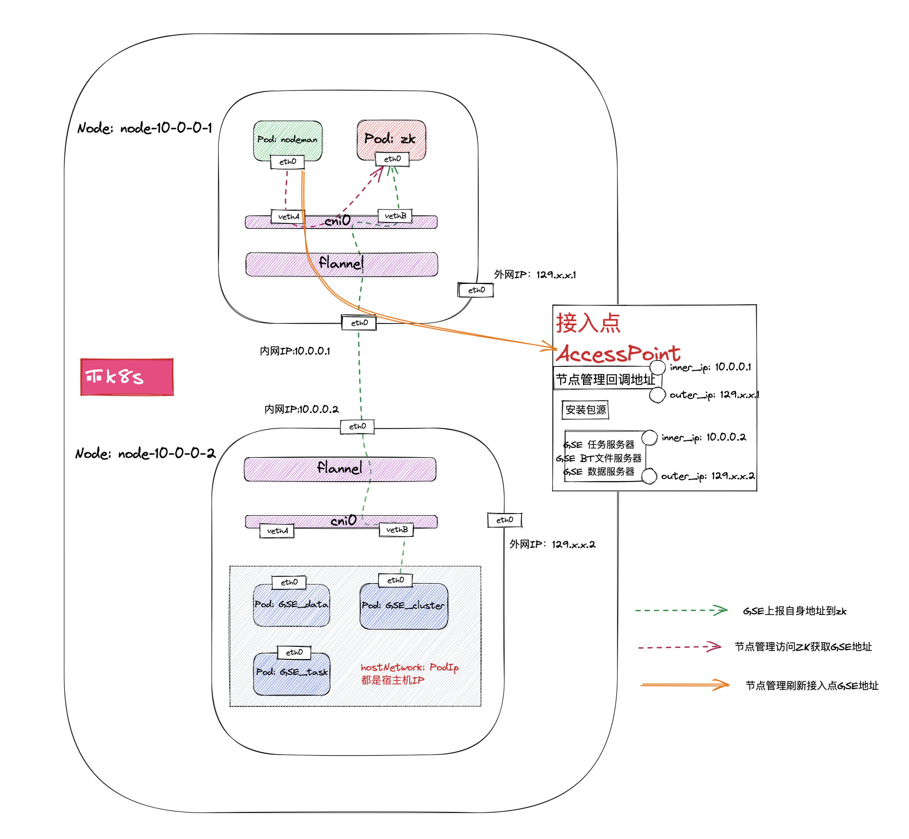

#### 蓝鲸 kubernetes 网络通信示意图

> 蓝鲸当前使用`Flannel`的`vxlan`来管理网络



#### 问题一：接入点信息不准确，非直连区域主机 安装/重装 失败

##### 问题描述

> 本文档命令中的命名空间`blueking`为蓝鲸默认值，请根据当前环境灵活调整

_当蓝鲸集群的 `GSE` 对外提供服务的相关 Pod 发生相关调度时，节点管理接入点信息指向地址会变更，非直连区域主机需要重新配置信息接入点来完成后续 Agent 安装任务_

###### 问题原因

1. 当蓝鲸的 k8s 集群部署在多个 NODE 节点时，POD 在自身的生命周期内可能会由集群发起调度
2. 当服务的 POD 可能从 Node-A 调度到 Node-B 时，kubernetes 会根据 pod 的 deployment 的网络模式重新给该 pod 分配 podIP
3. 重新分配 podIP 就导致了相关`GSE`或者是`节点管理`对外提供服务的地址变更，导致`节点管理`接入点信息中的相关`IP`地址不匹配，从而使得云区域`Agent`安装任务失败

   1. `GSE 1.0`: 会把自己的服务地址存储在`ZK`，节点管理会有后台任务定时获取对应的`IP`并更新到接入点信息内
   1. `GSE 2.0`: 并不会上报本身服务地址到`ZK`，节点管理也无法准确获取到`GSE`接入点相关信息
   2. `gse_cluster`、`gse_data`、`gse_task`, `gse_file` 的 `deployment` 使用的是 `hostNetwork`，所以部署时这三个服务分配的默认`podIP`就是节点的对应的实际内网 IP，但是由于 `GSE` 无法获取自身的出口外网`IP`，所以`GSE`注册自身服务在`zk`的方案只能解决`直连区域`的相关`Agent`上游地址变更问题，`Proxy` 和 `P-Agent`安装任务还是可能会失败
   3. 如果指定`Pod`的调度策略`nodeSelector`为某个指定`Node`可以解决以上问题，但是会发生更新`Pod`时的端口抢占问题，当前环境下的的相关策略可以通过以下命令查询

   ```bash
   # 如果结果为 `Node-Selectors: <none>` 则代表没有为`Pod`指定对应节点进行部署，如果已经指定，那在接入点的信息更新为该`Node`的相关地址即可
   for p in bk-gse-file bk-gse-data bk-gse-cluster bk-gse-task bk-nodeman-backend-api
   do
       kubectl describe pod $(kubectl get pod -n blueking -o wide | grep $p |awk '{print $1}' |tail -n 1) -n blueking | grep Node-Selectors
   done
   ```

###### kubernetes 参考资料

_[Pod 生命周期](https://kubernetes.io/zh-cn/docs/concepts/workloads/pods/pod-lifecycle/)_

_[将 Pod 指派给节点](https://kubernetes.io/zh-cn/docs/concepts/scheduling-eviction/assign-pod-node/)_

_[K8s 集群网络](https://kubernetes.io/docs/concepts/cluster-administration/networking/)_

#### 非 `Node-Selectors` 模式下的解决方案

###### GSE 出口 IP 更新

1. _每次更新完手动处理创建的接入点（不推荐）_
   更新方式：
   1. 通过节点管理`全局配置`中的`接入点`的`Server信息`，获取当前的 GSE NODE 内网地址，然后更新对应服务器的出口外网 IP

```bash
# 对应的内网IP可以使用下述对应命令获取，外网出口 IP 请根据实际情况获取
# Btfileserver
kubectl get pods -n blueking -l app=gse-file -o jsonpath='{.items[0].status.hostIP}'

# Dataserver
kubectl get pods -n blueking -l app=gse-data -o jsonpath='{.items[0].status.hostIP}'

#Taskserver
kubectl get pods -n blueking -l app=gse-cluster -o jsonpath='{.items[0].status.hostIP}'
```

2. _采取 CLB 的方式（推荐）_
   * 具体方案请参考 [通用解决方案：CLB](#通用解决方案：CLB)

###### 节点管理回调地址更新

> 节点管理后台默认通过  `NodePort`  的方式暴露服务，如果当前环境是  `NodePort`  模式，可以通过`K8s`集群任一节点的服务端口访问到后台服务

> k8s 部署模式下节点管理后台回调端口默认为：`30300`

_通过以下命令查询节点管理后台服务类型_

```bash
kubectl get services  -l app.kubernetes.io/instance=bk-nodeman -n blueking -o json | jq -r '.items[] | select(.metadata.name=="bk-nodeman-backend-api").spec.type'
```

_不同服务类型下回调地址_

1. `内网回调` 
   1. `NodePort`：`K8s`集群内的任意节点的内网地址
   2. `ClusterIP`：参考上述方案的中的命令，查询对应的 podIP `kubectl get pods -n blueking -l app.kubernetes.io/component=bk-nodeman-backend-api -o jsonpath='{.items[0].status.hostIP}'`
2. `外网回调`
   1. `NodePort`: `K8s`集群内的任意节点的出口 IP
   2. `ClusterIP`：通过上述命令查询到准确节点的出口 IP


_`ClusterIP` 类型下的解决方案_

1. _每次更新完手动处理创建的接入点（不推荐）_
2. _采取 CLB 的方式（推荐）_
   * 具体方案请参考 [通用解决方案：CLB](#通用解决方案：CLB)


_[NodePort Service 参考文档](https://kubernetes.io/zh-cn/docs/concepts/services-networking/service/#type-nodeport)_

#### 问题二：存量主机失联

###### 问题描述

_当蓝鲸集群的 `GSE` 对外提供服务的相关 Pod 发生相关调度时，存量主机状态丢失，采集信息上报异常_

  * ``GSE 1.0 异常主机范围``: 非直连区域主机
  * ``GSE 2.0 异常主机范围``: 所有主机

###### 问题原因

_`GSE`相关`POD`发生调度后，存量 Agent 相关`GSE`配置项地址发生变更_
  1. `GSE 1.0`：直连区域主机是通过 `zk` 进行 `GSE` 服务发现，所以当 `GSE` 相关 `POD` 发生调度时不受影响
  2. `GSE 2.0`：所有主机都需要配置准确的 `GSE` 服务地址，当 `GSE` 相关 `POD` 发生调度时，`GSE` 服务地址发生变更，导致所有存量主机都无法连接到 `GSE` 服务

###### 解决方案

1. *手动重装方式(不推荐)*
   1. 直连区域: _重装非直连区域 Agent_
   2. 非直连区域: _在方案一的基础上，重新配置好接入点相关信息后，重装 Agent_
   
2. _采取 CLB 的方式（推荐）_
   * 具体方案请参考 [通用解决方案：CLB](#通用解决方案：CLB)

#### 通用解决方案：CLB
> 弊端：如果后续新增的节点，需要在 CLB 配置上新加的节点

1. *GSE 出口 IP 更新 问题*
   * CLB 指向 kubernetes 中的所有节点为后端服务，这样不管每次更新 GSE 时，CLB 都会轮询检测可以通信的后端服务
   * 节点管理全局配置信息 GSE 的信息配置 CLB 的 IP 即可

2. _`ClusterIP`服务类型节点管理回调地址_
   * CLB 指向 kubernetes 中的所有节点为后端服务，这样不管`pod`在哪个节点，CLB 都会轮询检测可以通信的后端回调服务
   * 节点管理全局配置信息 `内外网回调地址` 的信息配置 CLB 的 IP 即可
   
3. _存量主机失联问题_
   * 已经失联主机，在接入点配置信息中的``GSE``相关地址配置 CLB 的 IP 后重装，后续将不会再出现该问题