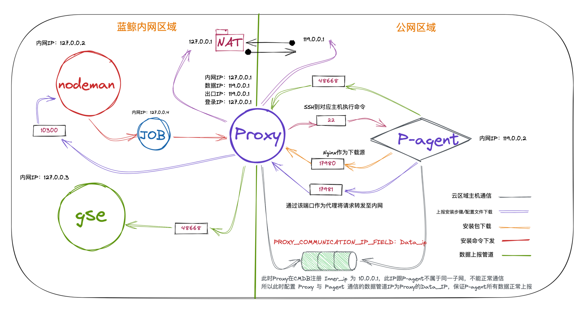

## 云区域主机通信字段变更

### 问题描述

  - 部分企业内网络复杂，在云区域主机通信时，并不能根据 Proxy 和 P-Agent 之间的内网进行通信，需要通过公网进行通信
  - 为了满足这种需求，需要在云区域主机通信时，增加一个字段，用于指定 Proxy 在节点管理注册的相关 IP 地址，用于与 P-Agent 进行通信

### 场景特殊性

  - 该场景下，企业使用的是公网 IP 在 CMDB 对 P-Agent 进行注册，而 Proxy 是使用内网 IP 进行注册，这样就会导致云区域主机通信失败
  - 以上场景通信失败的原因是: Proxy 默认是通过内网和 P-Agent 通信的，但 Proxy 处于「直连区域」，而希望纳入 Proxy 管控的 P-Agent 位于其他云区域，处于不同云区域，无法通过「内网 IP」进行通信

### 综上所述，节点管理提供定制化需求，增加配置项来解决相关复杂网络架构

  - 增加配置 `PROXY_COMMUNICATION_IP_FIELD`, 默认为 `inner_ip`，可指定为 `outer_ip`, `data_ip`, `login_ip` 等
  - 在图二场景下, 在节点管理 `admin` 页面 全局配置表新增配置 `PROXY_COMMUNICATION_IP_FIELD` 为上述指定字段，这样就可以实现将 P-Agent 的 `GSE` 相关上游地址配置
为 Proxy 所注册的指定字段地址，并且将相关上报代理地址指向 Proxy 上的 Nginx, 从而转发到蓝鲸内网的节点管理后台
    - 使用 `出口IP`，也就是 `outer_ip`：如果所有的云区域都是通过`外网IP/NAT IP` 与 P-gent 通信的，那就配置 `outer_ip`
    - 使用 `数据IP`，也就是 `data_ip`：仅部分云区域通过`外网IP/ NAT IP` 与 P-Agent 通信，通过数据库修改这部分云区域下 Proxy 的 `data_ip`，其他云区域仍使用默认的`内网 IP` 与 P-Agent 交互
  在节点管理安装 Proxy 时可以指定 `数据IP` 为 Proxy 在 NAT 转换后的地址  
  - 新增/修改该配置后，需要重启节点管理服务使配置生效

### 云区域主机通信流程图
> 下图中使用的相关端口为默认端口，具体跟环境相关，部分端口可自定义配置
 
> 48668：`Agent` 与 `GSE` 通信端口
> 
> 17980: `Nginx` 下载端口
> 
> 17981: `Nginx` 网络代理端口
> 
> 22: `P-Agent SSH` 端口, `Agent`安装时指定
> 
> 10300: 节点管理后台回调端口

#### Proxy 用内网与 P-Agent 通信符合大部分跨云管控场景

#### Proxy 使用内网管控，但是通过公网与 P-Agent 通信
