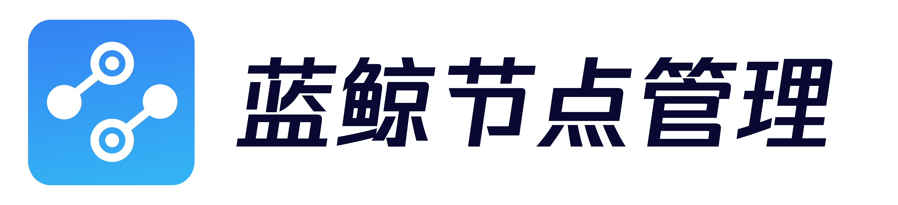

---

[English](readme_en.md) | 简体中文

用户的业务主机想要与蓝鲸服务体系建立联系，首先要确保每台业务主机安装 Agent 程序。蓝鲸推出节点管理 SaaS，用以解决各类网络环境下 Agent 的快速安装难题。

节点管理 是一款用来帮助运维人员实现 Agent 安装、插件管理等后台服务管理的应用。

和手动安装 Agent 的原理相同，但是节点管理省去了脚本安装命令的手动键入和繁琐执行。用户无需登录服务器，通过可视化的窗口即可直观简便的执行 Agent 安装和插件管理。支持多种环境下的 Agent 安装，支持主机的并发操作、CMDB 导入和批量导入等，支持插件的启动、停止、重启、重载、是否托管等管理操作，高效方便。

## Overview
蓝鲸节点管理

## Features
了解更多功能，请参考[蓝鲸节点管理白皮书](http://docs.bk.tencent.com/product_white_paper/bk_nodeman/)

## Getting started
- [开发环境后台部署](docs/install/dev_deploy.md)

## Version plan
- [版本日志](docs/release.md)

## Support
- [源码](https://github.com/TencentBlueKing/bk-nodeman/tree/master)
- [wiki](https://github.com/TencentBlueKing/bk-nodeman/wiki)
- [白皮书](http://docs.bk.tencent.com/product_white_paper/bk_nodeman/)
- [蓝鲸论坛](https://bk.tencent.com/s-mart/community)
- [蓝鲸 DevOps 在线视频教程](https://cloud.tencent.com/developer/edu/major-100008)
- 联系我们，技术交流QQ群：

  社区版QQ交流群：495299374
  
  蓝鲸运维开发交流群：878501914
  
  

## BlueKing Community
* [BK-CMDB](https://github.com/Tencent/bk-cmdb): 蓝鲸配置平台（蓝鲸 CMDB）是一个面向资产及应用的企业级配置管理平台。
- [BK-CI](https://github.com/Tencent/bk-ci): 蓝鲸持续集成平台是一个开源的持续集成和持续交付系统，可以轻松将你的研发流程呈现到你面前。
- [BK-BCS](https://github.com/Tencent/bk-bcs): 蓝鲸容器管理平台是以容器技术为基础，为微服务业务提供编排管理的基础服务平台。
- [BK-BCS-SaaS](https://github.com/Tencent/bk-bcs-saas): 蓝鲸容器管理平台 SaaS 基于原生 Kubernetes 和 Mesos 自研的两种模式，提供给用户高度可扩展、灵活易用的容器产品服务。
- [BK-PaaS](https://github.com/Tencent/bk-PaaS): 蓝鲸 PaaS 平台是一个开放式的开发平台，让开发者可以方便快捷地创建、开发、部署和管理 SaaS 应用。
- [BK-SOPS](https://github.com/Tencent/bk-sops): 标准运维（SOPS）是通过可视化的图形界面进行任务流程编排和执行的系统，是蓝鲸体系中一款轻量级的调度编排类 SaaS 产品。
- [BK-BASE](https://github.com/Tencent/bk-base): 蓝鲸基础计算平台(BK-BASE)是一个专注于运维领域的的基础平台，打造一站式、低门槛的基础服务。通过简化运维数据的收集、获取，提升数据开发效率，辅助运维人员实时运维决策，助力企业运营体系数字化、智能化转型。

## Contributing
如果你有好的意见或建议，欢迎给我们提 Issues 或 Pull Requests，为蓝鲸开源社区贡献力量。关于 蓝鲸节点管理 分支管理、Issue 以及 PR 规范，
请阅读 [Contributing Guide](docs/CONTRIBUTING.md)。

[腾讯开源激励计划](https://opensource.tencent.com/contribution) 鼓励开发者的参与和贡献，期待你的加入。

## License
蓝鲸节点管理 是基于 MIT 协议， 详细请参考 [LICENSE](https://github.com/TencentBlueKing/bk-nodeman/blob/master/LICENSE) 

我们承诺未来不会更改适用于交付给任何人的当前项目版本的开源许可证（MIT 协议）。
