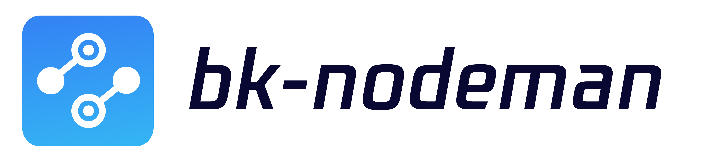
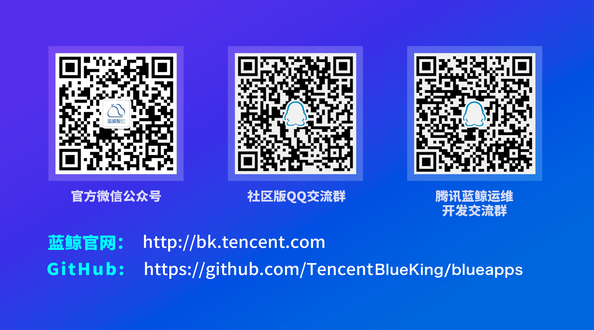

---

English | [简体中文](readme.md)

To establish a connection with BlueKing's service system, users' business hosts must first ensure that each business host installs the Agent program. BlueKing has launched NodeMan SaaS to solve the problem of quick installation of Agent in various network environments.

NodeMan is an application that helps operation and maintenance personnel to realize Agent installation, plug-in management and other back-end service management.

It is the same principle as manual Agent installation, but NodeMan eliminates the need for manual typing and tedious execution of script installation commands. Users can perform Agent installation and plug-in management intuitively and easily through a visual window without logging into the server. It supports Agent installation in various environments, concurrent host operation, CMDB import and batch import, and plugin management such as start, stop, restart, reload, and whether to host or not, which is efficient and convenient.

## Overview
BlueKing NodeMan

## Features
For more features, please refer to [BlueKing NodeMan White Paper](http://docs.bk.tencent.com/product_white_paper/bk_nodeman/)

## Getting started
- [Development environment backend deployment](docs/install/dev_deploy.md)

## Version plan
- [Version log](docs/release.md)

## Support
- [source](https://github.com/TencentBlueKing/bk-nodeman/tree/master)
- [wiki](https://github.com/TencentBlueKing/bk-nodeman/wiki)
- [whitepaper](http://docs.bk.tencent.com/product_white_paper/bk_nodeman/)
- [BlueKing Forum](https://bk.tencent.com/s-mart/community)
- [BlueKing DevOps Online Video Tutorial](https://cloud.tencent.com/developer/edu/major-100008)
- Contact us, technical exchange QQ group:.

  Community Edition QQ exchange group: 495299374
  
  BlueKing Ops development exchange group: 878501914
  
  

## BlueKing Community
- [BK-CI](https://github.com/Tencent/bk-ci): BlueKing Continuous Integration is a continuous integration and continuous delivery system that can easily present your R & D process to you.
- [BK-BCS](https://github.com/Tencent/bk-bcs): BlueKing Container Service is an orchestration platform for microservices based on container technology.
- [BK-BCS-SaaS](https://github.com/Tencent/bk-bcs-saas): SaaS of BlueKing Container Service is based on two modes, the native Kubernetes mode and the Mesos self-developed mode. It provides highly scalable, flexible and easy-to-use container management service for users.
- [BK-CMDB](https://github.com/Tencent/bk-cmdb): BlueKing Configuration Management DataBase (BlueKing CMDB) is an enterprise level configuration management platform for assets and applications.
- [BK-PaaS](https://github.com/Tencent/bk-PaaS): BlueKing PaaS is an open development platform that allows developers to create, develop, deploy and manage SaaS applications quickly and easily.
- [BK-SOPS](https://github.com/Tencent/bk-sops): BlueKing Standard OPS (SOPS) is a light-weighted SaaS product in the Tencent BlueKing product system designed for the orchestration and execution of tasks through a graphical interface.
- [BK-BASE](https://github.com/Tencent/bk-base): BK-BASE is a basic platform focusing on the field of operation and maintenance, creating a one-stop, low-threshold basic service.

## Contributing
- If you have good comments or suggestions, welcome to give us Issues or Pull Requests to contribute to the BlueKing open source community. For more information about BlueKing node management, branch management, Issue and PR specification. Please read the [Contributing Guide](docs/CONTRIBUTING.md).
- [Tencent Open Source Incentive Program](https://opensource.tencent.com/contribution) encourages developers to participate and contribute, and we look forward to your participation.

## License
BlueKing NodeMan is based on MIT protocol, please refer to [LICENSE](https://github.com/TencentBlueKing/bk-nodeman/blob/master/LICENSE) for details 

We undertake not to change the open source license (MIT license) applicable to the current version of the project delivered to anyone in the future.